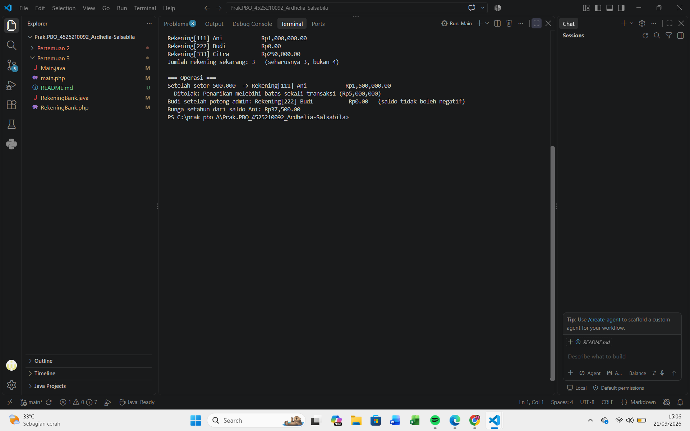
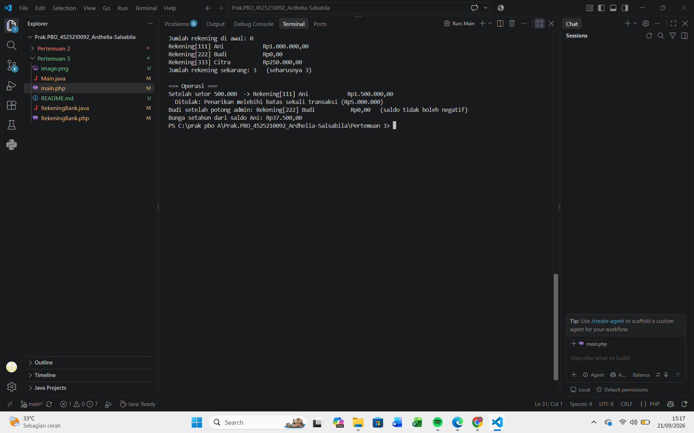

# RekeningBank — Praktikum PBO Pertemuan 3

Implementasi kelas `RekeningBank` dalam dua bahasa, **Java** dan **PHP**, untuk mempraktikkan konsep constructor, anggota statis (`static`), dan konstanta bernama. Kedua versi memiliki perilaku yang sama, sehingga cocok dipakai untuk membandingkan cara masing-masing bahasa menyelesaikan masalah yang sama.

## Daftar Isi

- [Struktur Folder](#struktur-folder)
- [Konsep yang Dipraktikkan](#konsep-yang-dipraktikkan)
- [Invariant Kelas](#invariant-kelas)
- [Fitur](#fitur)
- [Perbandingan Java dan PHP](#perbandingan-java-dan-php)
- [Prasyarat](#prasyarat)
- [Cara Menjalankan](#cara-menjalankan)
- [Contoh Output](#contoh-output)
- [Catatan Desain](#catatan-desain)

## Struktur Folder

```
Pertemuan 3/
├── RekeningBank.java   # kelas utama versi Java
├── Main.java           # program uji versi Java
├── RekeningBank.php    # kelas utama versi PHP
├── main.php            # program uji versi PHP
└── README.md
```

## Konsep yang Dipraktikkan

| Konsep | Java | PHP |
|---|---|---|
| Konstanta bernama | `public static final double` | `public const` |
| Penghitung statis | `private static int jumlahRekening` | `private static int $jumlahRekening` |
| Constructor ringkas | Constructor overloading, didelegasikan dengan `this(...)` | Default parameter (`$saldoAwal = 0`) |
| Constructor alternatif | Tidak diperlukan (sudah ada overloading) | Named constructor `rekeningPelajar()` memakai `new static` |
| Field yang tidak berubah | `private final String nomor` | `private readonly string $nomor` |
| Method statis | `getJumlahRekening()`, `bungaSetahun()` | `getJumlahRekening()`, `bungaSetahun()` |

**Constructor delegation (Java).** Constructor ringkas `RekeningBank(nomor, pemilik)` meneruskan pekerjaannya ke constructor lengkap lewat `this(nomor, pemilik, 0)`. Validasi dan penambahan penghitung hanya ada di satu tempat, sehingga setiap objek menaikkan penghitung tepat satu kali.

**Named constructor (PHP).** PHP tidak mendukung constructor overloading. Padanannya adalah default parameter dan static factory `rekeningPelajar()`. Factory memakai `new static`, bukan `new self`, agar subclass yang memanggilnya menghasilkan objek subclass itu sendiri (*late static binding*).

## Invariant Kelas

Tiga aturan yang harus selalu benar selama objek hidup:

1. Saldo tidak pernah negatif.
2. Nomor rekening tidak berubah setelah objek dibuat.
3. Setoran dan penarikan selalu bernilai positif.

## Fitur

**Konstanta**

| Nama | Nilai | Keterangan |
|---|---|---|
| `BUNGA_TAHUNAN` | `0.025` | Bunga 2,5% per tahun |
| `BIAYA_ADMIN` | `5000` | Biaya administrasi |
| `BATAS_TARIK_SEKALI` | `5.000.000` | Batas penarikan per transaksi |

**Method**

| Method | Fungsi |
|---|---|
| Constructor | Membuat rekening. Menolak nomor kosong, saldo awal negatif, `NaN`, dan tak hingga |
| `setor(jumlah)` | Menambah saldo. Menolak jumlah yang tidak positif, `NaN`, dan tak hingga |
| `tarik(jumlah)` | Mengurangi saldo. Menolak jumlah tidak valid, melebihi batas sekali tarik, atau melebihi saldo |
| `potongBiayaAdmin()` | Mengurangi saldo sebesar biaya admin, minimal hingga `0` |
| `getJumlahRekening()` (statis) | Jumlah rekening yang berhasil dibuat |
| `bungaSetahun(pokok)` (statis) | Bunga setahun dari pokok (`pokok * BUNGA_TAHUNAN`) |
| `getSaldo()`, `getNomor()` | Getter |
| `toString()` / `__toString()` | Representasi teks rekening |

**Validasi `NaN` dan tak hingga.** Nilai `NaN` selalu menghasilkan `false` pada perbandingan seperti `<= 0`, sehingga pengecekan biasa bisa lolos. Karena itu kondisi valid ditulis secara positif lalu dinegasikan (`!(jumlah > 0)`), ditambah pengecekan tak hingga (`Double.isInfinite` di Java, `is_finite` di PHP).

## Perbandingan Java dan PHP

| Aspek | Java | PHP |
|---|---|---|
| Jenis exception "saldo tidak cukup" | `IllegalArgumentException` | `RuntimeException` |
| Jenis exception validasi lain | `IllegalArgumentException` | `InvalidArgumentException` |
| Pengecekan `NaN` dan tak hingga | `!(x > 0) \|\| Double.isInfinite(x)` | `!is_finite($x) \|\| !($x > 0)` |
| Format uang | `String.format("%,.2f")` (mengikuti locale) | `number_format($x, 2, ',', '.')` |
| Nilai penutup saldo | `Math.max(0, ...)` | `max(0.0, ...)` |

## Prasyarat

- **Java:** JDK 11 atau lebih baru (memakai `String.isBlank()`).
- **PHP:** PHP 8.1 atau lebih baru (memakai `readonly` pada promoted property).

Cek versi yang terpasang:

```bash
javac -version
php -v
```

## Cara Menjalankan

Masuk ke folder `Pertemuan 3` terlebih dahulu.

**Java**

```bash
javac Main.java RekeningBank.java
java Main
```

Di VS Code, kamu juga bisa membuka `Main.java` lalu menekan tombol **Run** di atas method `main`.

**PHP**

```bash
php main.php
```

`main.php` memuat `RekeningBank.php` lewat `require_once __DIR__ . '/RekeningBank.php'`, jadi kedua file harus berada di folder yang sama.

## Contoh Output

**Java** (format angka mengikuti locale sistem; contoh di bawah memakai locale en-US)

```
Jumlah rekening di awal: 0
Rekening[111] Ani            Rp1,000,000.00
Rekening[222] Budi           Rp0.00
Rekening[333] Citra          Rp250,000.00
Jumlah rekening sekarang: 3   (seharusnya 3, bukan 4)

=== Operasi ===
Setelah setor 500.000  -> Rekening[111] Ani            Rp1,500,000.00
  Ditolak: Penarikan melebihi batas sekali transaksi (Rp5,000,000)
Budi setelah potong admin: Rekening[222] Budi           Rp0.00   (saldo tidak boleh negatif)
Bunga setahun dari saldo Ani: Rp37,500.00
```

**PHP**

```
Jumlah rekening di awal: 0
Rekening[111] Ani            Rp1.000.000,00
Rekening[222] Budi           Rp0,00
Rekening[333] Citra          Rp250.000,00
Jumlah rekening sekarang: 3   (seharusnya 3)

=== Operasi ===
Setelah setor 500.000  -> Rekening[111] Ani            Rp1.500.000,00
  Ditolak: Penarikan melebihi batas sekali transaksi (Rp5.000.000)
Budi setelah potong admin: Rekening[222] Budi           Rp0,00   (saldo tidak boleh negatif)
Bunga setahun dari saldo Ani: Rp37.500,00
```

Program uji memeriksa empat hal: penghitung rekening hanya naik satu per objek (3, bukan 4), penarikan di atas batas ditolak, saldo tidak menjadi negatif setelah biaya admin, dan bunga dihitung dari saldo terbaru.

## Catatan Desain

- **Penghitung hanya naik jika objek berhasil dibuat.** Penambahan `jumlahRekening` diletakkan setelah semua validasi, sehingga constructor yang melempar exception tidak ikut dihitung.
- **`pemilik` belum divalidasi.** Bisa ditambahkan pengecekan `null` atau kosong seperti pada `nomor`.
- **Keamanan thread.** `jumlahRekening++` tidak aman untuk banyak thread. Untuk aplikasi nyata di Java gunakan `AtomicInteger`.
- **Presisi uang.** `double` (Java) dan `float` (PHP) memiliki galat pembulatan. Untuk aplikasi nyata gunakan `BigDecimal` (Java) atau simpan nominal sebagai integer sen / `bcmath` (PHP). Untuk latihan ini, tipe desimal biasa sudah cukup.

