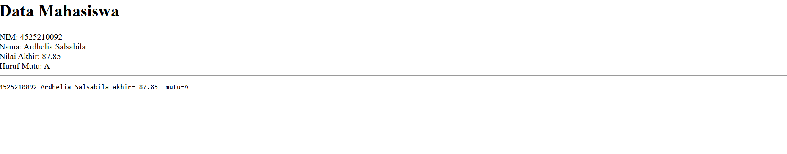
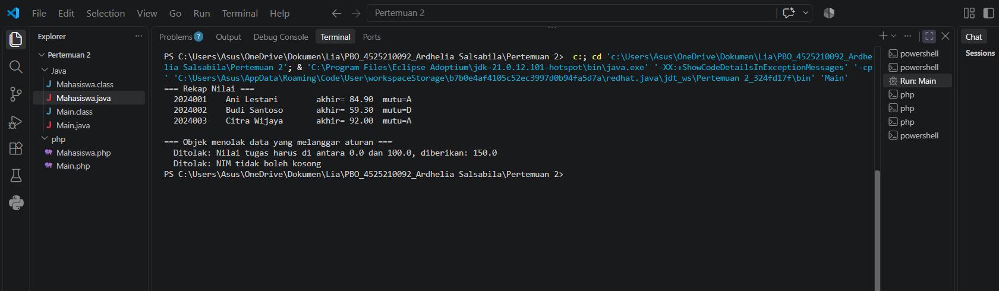

# Praktikum Pemrograman Berbasis Objek (PBO) — Sesi 2
**Materi:** Enkapsulasi & Menjaga Invariant  
**Nama:** Ardhelia Salsabila  
**NIM:** 4525210092  

---

## 📌 Deskripsi Tugas
Tugas ini membahas penerapan konsep **Enkapsulasi** dan **Menjaga Invariant** pada kelas `Mahasiswa` menggunakan dua bahasa pemrograman berorientasi objek yang berbeda, yaitu **PHP (PHP 8)** dan **Java**.

### Aturan Invariant yang Diterapkan:
1. **NIM** tidak boleh kosong/null dan sifatnya *immutable* (tidak dapat diubah setelah objek dibuat).
2. Nilai komponen (**Tugas**, **UTS**, **UAS**) berada dalam rentang $0.00 - 100.00$.
3. Perhitungan **Nilai Akhir** menggunakan pembobotan konstanta:
   $$\text{Nilai Akhir} = (30\% \times \text{Tugas}) + (30\% \times \text{UTS}) + (40\% \times \text{UAS})$$
4. **Huruf Mutu** ditentukan berdasarkan rentang Nilai Akhir:
   * $\ge 80 \rightarrow \mathbf{A}$
   * $\ge 70 \rightarrow \mathbf{B}$
   * $\ge 60 \rightarrow \mathbf{C}$
   * $\ge 50 \rightarrow \mathbf{D}$
   * $< 50 \rightarrow \mathbf{E}$

---

## 1. Implementasi PHP (`Mahasiswa.php`)

Pada PHP 8, enkapsulasi dan immutability memanfaatkan fitur modern seperti *Constructor Property Promotion* dan kata kunci `readonly`.

### 📄 Source Code PHP
```php
<?php
declare(strict_types=1);

class Mahasiswa
{
    public const BOBOT_TUGAS = 0.30;
    public const BOBOT_UTS   = 0.30;
    public const BOBOT_UAS   = 0.40;

    private const NILAI_MIN = 0;
    private const NILAI_MAX = 100;

    public function __construct(
        private readonly string $nim,
        private readonly string $nama,
        private float $nilaiTugas,
        private float $nilaiUts,
        private float $nilaiUas,
    ) {
        if (trim($this->nim) === '') {
            throw new InvalidArgumentException('NIM tidak boleh kosong');
        }

        self::pastikanNilaiSah('tugas', $this->nilaiTugas);
        self::pastikanNilaiSah('UTS', $this->nilaiUts);
        self::pastikanNilaiSah('UAS', $this->nilaiUas);
    }

    private static function pastikanNilaiSah(string $namaKomponen, float $nilai): void
    {
        if ($nilai < self::NILAI_MIN || $nilai > self::NILAI_MAX) {
            throw new InvalidArgumentException(
                sprintf('Nilai %s harus di antara %s dan %s, diberikan: %s',
                    $namaKomponen, self::NILAI_MIN, self::NILAI_MAX, $nilai)
            );
        }
    }

    public function nilaiAkhir(): float
    {
        return $this->nilaiTugas * self::BOBOT_TUGAS
             + $this->nilaiUts * self::BOBOT_UTS
             + $this->nilaiUas * self::BOBOT_UAS;
    }

    public function hurufMutu(): string
    {
        $akhir = $this->nilaiAkhir();
        return match (true) {
            $akhir >= 80 => 'A',
            $akhir >= 70 => 'B',
            $akhir >= 60 => 'C',
            $akhir >= 50 => 'D',
            default => 'E',
        };
    }

    public function getNim(): string  { return $this->nim; }
    public function getNama(): string { return $this->nama; }
    public function getNilaiAkhir(): float { return $this->nilaiAkhir(); }

    public function __toString(): string
    {
        return sprintf('%-10s %-18s akhir=%6.2f  mutu=%s',
            $this->nim, $this->nama, $this->nilaiAkhir(), $this->hurufMutu());
    }
}

// Instansiasi Objek & Pengujian Output
try {
    $mhs = new Mahasiswa("4525210092", "Ardhelia Salsabila", 85.5, 90.0, 88.0);
    echo "<h1>Data Mahasiswa</h1>";
    echo "NIM: " . $mhs->getNim() . "<br>";
    echo "Nama: " . $mhs->getNama() . "<br>";
    echo "Nilai Akhir: " . $mhs->getNilaiAkhir() . "<br>";
    echo "Huruf Mutu: " . $mhs->hurufMutu() . "<br><hr>";
    echo "<pre>" . $mhs . "</pre>";
} catch (InvalidArgumentException $e) {
    echo "Error Validasi: " . $e->getMessage();
}
```

### 🖼️ Hasil Running (PHP)

| Hasil Output di Browser |
| :---: | :---: |
  |

---

## 2. Implementasi Java (`Mahasiswa.java`)

Pada Java, atribut yang tidak boleh diubah menggunakan kata kunci `final`, serta validasi invariant dilakukan di dalam konstruktor menggunakan `IllegalArgumentException`.

### 📄 Source Code Java
```java
public class Mahasiswa {

    public static final double BOBOT_TUGAS = 0.30;
    public static final double BOBOT_UTS   = 0.30;
    public static final double BOBOT_UAS   = 0.40;

    private static final double NILAI_MIN = 0;
    private static final double NILAI_MAX = 100;

    private final String nim;
    private final String nama;
    private double nilaiTugas;
    private double nilaiUts;
    private double nilaiUas;

    public Mahasiswa(String nim, String nama, double nilaiTugas, double nilaiUts, double nilaiUas) {
        if (nim == null || nim.isBlank()) {
            throw new IllegalArgumentException("NIM tidak boleh kosong");
        }

        pastikanNilaiSah("tugas", nilaiTugas);
        pastikanNilaiSah("UTS", nilaiUts);
        pastikanNilaiSah("UAS", nilaiUas);

        this.nim = nim;
        this.nama = nama;
        this.nilaiTugas = nilaiTugas;
        this.nilaiUts = nilaiUts;
        this.nilaiUas = nilaiUas;
    }

    private static void pastikanNilaiSah(String namaKomponen, double nilai) {
        if (nilai < NILAI_MIN || nilai > NILAI_MAX) {
            throw new IllegalArgumentException(
                    "Nilai " + namaKomponen + " harus di antara " + NILAI_MIN + " dan " + NILAI_MAX
                            + ", diberikan: " + nilai);
        }
    }

    public double nilaiAkhir() {
        return nilaiTugas * BOBOT_TUGAS + nilaiUts * BOBOT_UTS + nilaiUas * BOBOT_UAS;
    }

    public String hurufMutu() {
        double akhir = nilaiAkhir();
        if (akhir >= 80) return "A";
        if (akhir >= 70) return "B";
        if (akhir >= 60) return "C";
        if (akhir >= 50) return "D";
        return "E";
    }

    public String getNim()  { return nim; }
    public String getNama() { return nama; }
    public double getNilaiAkhir() { return nilaiAkhir(); }

    @Override
    public String toString() {
        return String.format("%-10s %-18s akhir=%6.2f  mutu=%s",
                nim, nama, nilaiAkhir(), hurufMutu());
    }

    public static void main(String[] args) {
        try {
            Mahasiswa mhs = new Mahasiswa("4525210092", "Ardhelia Salsabila", 85.5, 90.0, 88.0);
            System.out.println("Data Mahasiswa:");
            System.out.println("NIM         : " + mhs.getNim());
            System.out.println("Nama        : " + mhs.getNama());
            System.out.println("Nilai Akhir : " + mhs.getNilaiAkhir());
            System.out.println("Huruf Mutu  : " + mhs.hurufMutu());
            System.out.println("\nFormat String:");
            System.out.println(mhs);
        } catch (IllegalArgumentException e) {
            System.err.println("Error Validasi: " + e.getMessage());
        }
    }
}
```

### 🖼️ Hasil Running (Java)

| Hasil Output di Terminal / Console |
| :---: | :---: |
|  |

---

## 📊 Perbandingan Implementasi (PHP vs Java)

| Fitur / Konsep | PHP 8 | Java |
| :--- | :--- | :--- |
| **Immutability Atribut** | Menggunakan kata kunci `readonly` | Menggunakan kata kunci `final` |
| **Ringkasan Konstruktor** | Menggunakan *Constructor Property Promotion* | Konstruktor eksplisit tradisional |
| **Eksepsi Validasi** | `InvalidArgumentException` | `IllegalArgumentException` |
| **Pencetakan Objek** | Magic method `__toString()` | Override method `toString()` |